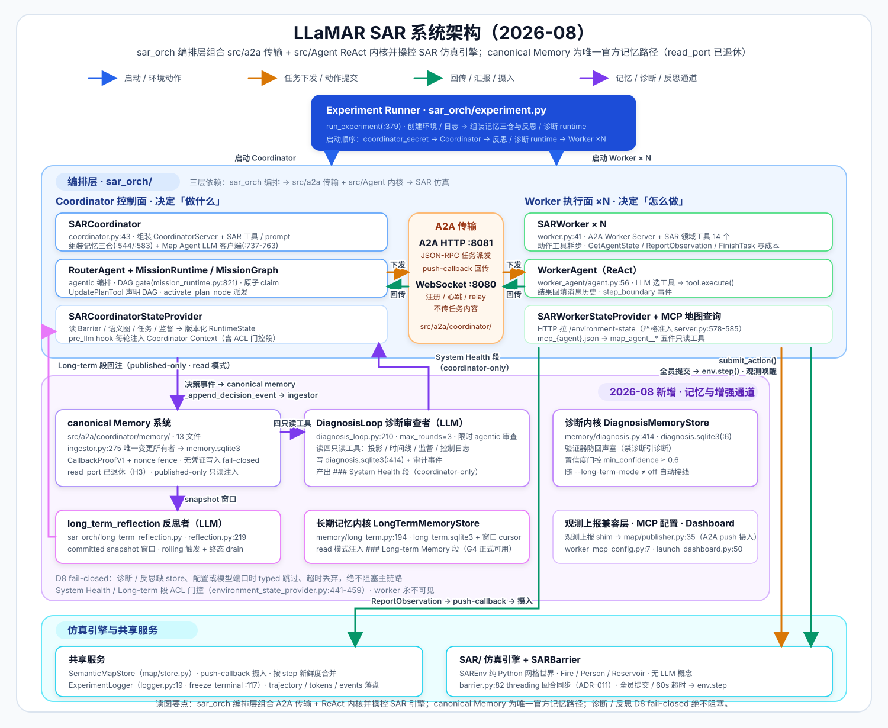
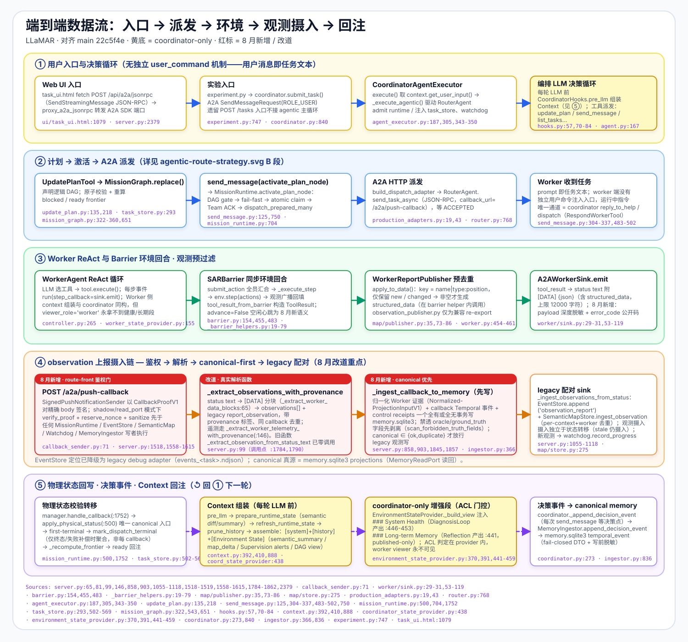
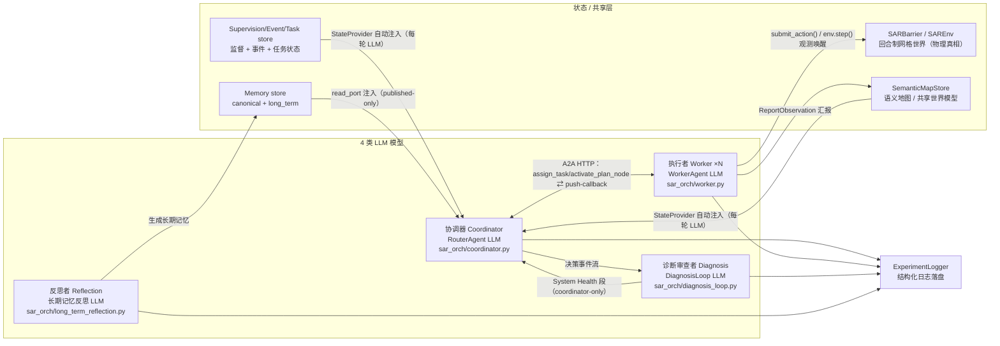
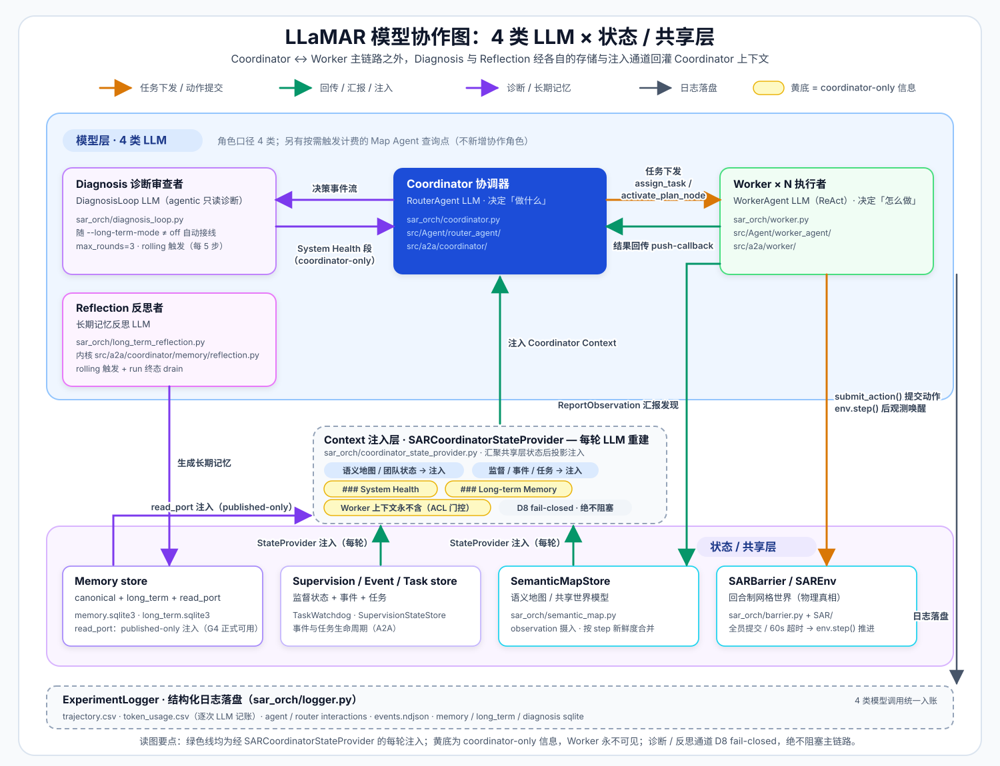

# LLaMAR SAR 系统架构概览

> 本文档聚焦 `sar_orch/experiment.py` 驱动的 SAR（Search & Rescue）实验路径，是对 `框架.md`（更详尽的全量参考）的一份精简、经代码核实的入口导览。所有结论均基于当前代码直接验证（行号以 2026-08-29 main @ b081d5a 快照为准，建议配合类/函数级锚点使用），标注 `文件:行号` 可自行核对。

## 1. 一句话概览

`experiment.py` 启动一个 Coordinator（协调器 LLM）+ N 个 Worker（执行者 LLM）的多智能体系统，并按配置在后台接线诊断审查者（DiagnosisLoop LLM）与反思者（长期记忆 Reflection LLM），共 4 类 LLM 协作（见第 8 节模型协作图）。主体通过自建的 A2A 协议通信，共同在 `SARBarrier` 包裹的回合制网格世界（`SAREnv`）里协作灭火、搜救、搬运，全程写入结构化日志。

## 2. 系统架构图与模块清单



> 注：`architecture.svg` 最后更新于 2026-08-06（memory P0-P2 时点），尚未覆盖其后的 read_port 退休、P3-P5 诊断通道与 G4 read 正式可用；最新模型协作关系以第 8 节 mermaid 图与 `images/model_collaboration.svg` 为准。

### 2.1 核心组件（experiment.py 统一创建与管理生命周期，`sar_orch/experiment.py:379 run_experiment()`）

| 组件 | 文件 | 职责 |
|------|------|------|
| **SARBarrier** | `sar_orch/barrier.py:82` | 包裹 `SAREnv`，用 `threading.Event`/`Lock` 做多智能体回合同步（worker 跑在各自线程独立事件循环里，不能用 asyncio 原语跨线程同步） |
| **SARCoordinator** | `sar_orch/coordinator.py:43` | 包裹 `src/a2a/coordinator/server.py` 的 `CoordinatorServer` + SAR 专属工具/prompt，内核用 `src/Agent/router_agent/` 的 ReAct Agent；组装 canonical/long_term/diagnosis 记忆三仓（`:544/:583`）与 Map Agent LLM 客户端（`:737-763`） |
| **SARWorker × N** | `sar_orch/worker.py:26` | 包裹 `src/a2a/worker/` 的 A2A Worker Server + SAR 领域工具，内核用 `src/Agent/worker_agent/` 的 ReAct Agent；挂 `SARWorkerStateProvider`（`:431`）并写 worker MCP 配置（`:193/:223`） |
| **ExperimentLogger** | `sar_orch/logger.py:19` | 线程安全 CSV/NDJSON 日志，覆盖每步指标、每次工具调用、token 用量等；`freeze_terminal()`（`:117`）在 run 终态冻结 CSV，保证崩溃时 `summary.csv` 仍有最新数据 |

### 2.2 2026-08 新增模块（逐一经代码核实）

| 模块 | 锚点 | 内部运转机制（读入 → 做什么 → 写出/影响谁） |
|------|------|------|
| **诊断审查者 DiagnosisLoop** | `sar_orch/diagnosis_loop.py:198` | 读 canonical memory 四类只读查询工具（投影/时间线/监督/控制日志，`:217-222`）→ 限轮限时的 agentic LLM 审查（`run():237`，超时/拒绝/轮数耗尽均 typed 退出）→ 写 `diagnosis.sqlite3`（`memory/diagnosis.py:414`）+ 审计事件（`:422`），产出以 `### System Health` 段回注 Coordinator 上下文（worker 永不可见） |
| **反思接线 long_term_reflection** | `sar_orch/long_term_reflection.py` | 读 committed snapshot 事件窗口（`coordinator.py:982 long_term_snapshot`）→ 后台线程 `_rolling_worker()`（`:232`）按触发点限频驱动反思与诊断（`maybe_trigger_rolling_reflection():395`，in-flight coalesce）→ 写 `long_term.sqlite3`（`memory/long_term.py:194`）；LLM 模型端口 `build_reflection_model_port():173`（读 `.env` 的 `reflection_*` 键并回落 generic 键） |
| **状态投影三件套** | `sar_orch/coordinator_state_provider.py:22` / `sar_orch/worker_state_provider.py:79` / `sar_orch/environment_state_provider.py:279` | 读 SemanticMap/团队/任务/监督视图 + memory read_port → 组装版本化 RuntimeState 与 `EnvironmentStateView`（ACL 门控 `_is_system():349`，System Health/Long-term 段仅 system principal + read 模式可见，`:441-459`）→ 每轮 LLM 前经 pre_llm hook 注入 Coordinator/Worker 上下文（`src/Agent/router_agent/hooks.py:74-82`） |
| **观测上报兼容层** | `sar_orch/observation_publisher.py:1`（兼容 shim，真身 `sar_orch/map/publisher.py:35 WorkerReportPublisher`） | 读 worker 侧观测 → 去重后经 A2A push 上报 → Coordinator `server.py:1518` push-callback 摄入 `SemanticMapStore` |
| **Worker MCP 配置** | `sar_orch/worker_mcp_config.py:7` | 读 worker 名单 → 为每个 worker 生成 `mcp_{agent}.json`（指向 Coordinator `/mcp/map`）→ worker 启动时加载 `map_agent__*` MCP 地图查询工具 |
| **Dashboard 启动器** | `sar_orch/launch_dashboard.py:50` | 读 `.env`/端口配置 → 只起基础设施（coordinator + workers）等待 UI 提交任务 → 不自动派任务，无 poll/反思链（LLM/state 接线与 experiment.py 同构） |
| **canonical Memory 系统** | `src/a2a/coordinator/memory/`（13 文件） | 读认证回调（`callback_auth.py` 的 CallbackProofV1 + nonce fence，密钥为 per-run 生成的 `coordinator_secret`，`experiment.py:541-550`）→ `MemoryIngestor`（`ingestor.py:275`，唯一变更所有者）写入 `memory.sqlite3`（`store.py:295`，路径契约 `contracts.py:663`）→ 投影归约（`projections.py`）+ read_port 只读注入（published-only）+ 共享脱敏（`redaction.py`） |
| **长期记忆内核** | `memory/long_term.py:194 LongTermMemoryStore` | 读 committed snapshot 事件流 → 存 `<memory_root>/long_term/long_term.sqlite3` + 窗口 cursor（`:113/:461`）→ `--long-term-mode read` 时以 `### Long-term Memory` 段注入 Coordinator（published-only，worker 不可见） |
| **诊断内核** | `memory/diagnosis.py:414 DiagnosisMemoryStore` | 存 `diagnosis.sqlite3`（`:6`）+ 诊断验证器（防回声室：禁诊断引诊断，`:11-14`）+ 置信度门控（`min_confidence ≥ 0.6`） |

### 2.3 启动顺序（`experiment.py`）

shadow/read_port 模式先生成 per-run `coordinator_secret`（`:541-550`）→ 加载 `long_term.config` 可调项（`:572-604`）→ 起 Coordinator 绑定端口 → 等 3s（`:641`）→ 接线反思/诊断 runtime（`configure_long_term_runtime` `:653-654`、`configure_diagnosis_runtime` `:666-697`）→ 起 N 个 Worker（各自通过 WebSocket 连回 Coordinator 注册）→ 等 5s 确保注册完成（`:738-740`，Phase 2+3 调整值）→ 提交初始任务描述（默认 "Extinguish all fires and rescue all persons"）→ 轮询 barrier 直到完成或超预算。运行中按 rolling 触发点（任务完成/每 N 步/监督事件，`:867-894`）驱动反思与诊断；run 终态 drain 后执行终态反思（`_invoke_run_terminal_long_term_reflection`，`:258`）。

## 3. 三层依赖关系

```
sar_orch/         SAR 领域编排层（本文档主视角，场景/工具/日志/实验脚本）
   │  包裹/复用
   ▼
src/a2a/          A2A 协议传输层（Coordinator-Worker 通信基础设施，域无关）
src/Agent/        自建 ReAct Agent 内核（router_agent/ + worker_agent/，域无关）
   │  操控
   ▼
SAR/              底层网格世界仿真引擎（Fire/Person/Reservoir/... 纯 Python，无 LLM 概念）
```

`sar_orch/` 不修改 `src/a2a/`、`src/Agent/`、`SAR/` 的代码，只通过组合（继承/工具注入/prompt 覆写）接入 SAR 场景。canonical Memory 系统（`src/a2a/coordinator/memory/`，13 文件）属 A2A 层内域无关的基础设施，由 `sar_orch` 在组装 coordinator/worker 时接入。

## 4. Coordinator 侧关键组件（`src/a2a/coordinator/`）

| 组件 | 文件 | 职责 |
|---|---|---|
| `CoordinatorServer` | `server.py:347` | FastAPI 主服务（约 2846 行），托管 WebSocket（`:2426 /ws/worker/{id}`）+ A2A 代理（`:2379 /api/a2a/jsonrpc`）+ push-callback（`:1518`）+ `/environment-state`（`:2123`，严格准入 `:578-585`）+ REST + UI 静态托管 + Map Agent 挂载（`:1027-1031/:2459`） |
| `RouterAgent` | `router.py:247` | LLM 驱动的规划/调度层；agentic 模式下作为被 ReAct 循环驱动的 Agent 本体 |
| `CoordinatorAgentExecutor` | `agent_executor.py:98` | 按 `dag` / `agentic` 两种编排模式驱动整个任务执行（`sar_orch` 默认用 `agentic`，`experiment.py:623`） |
| `MissionRuntime` / `MissionRuntimeManager` | `mission_runtime.py:161/1368` | 物理 Dispatch 状态机权威，进程内单例，一次只准入一个活跃 mission；DAG gate 在 `_run_dag_gate()`（`:821`，调用点 `:727`） |
| `MissionGraph` | `mission_graph.py:296` | 纯逻辑 DAG，节点状态独立于物理 dispatch，由 LLM 通过 `UpdatePlanTool` 声明；节点枚举 `LogicalState`（`:20-30`），终态 frozenset（`:32`） |
| `TeamPartitionService` | `team_partition_service.py:756` | 多 participant 节点的 Team ACK saga（`has_delivery_adapter` property `:780`，见第 10 节） |
| `TaskWatchdog` + `SupervisionStateStore` | `task_watchdog.py:42` + `supervision_state_store.py:110` | 任务监督：TASK_STALE / WORKER_UNREACHABLE / DEADLINE 事件，独立持久化监督状态，供诊断通道与 Coordinator 环境状态消费 |
| `EventStore` | `event_store.py:55` | 任务事件记录（诊断通道的决策事件源之一） |
| `memory/` 子包（13 文件） | `store.py:295` / `ingestor.py:275` / `long_term.py:194` / `diagnosis.py:414` / `reflection.py:218` | canonical 记忆存储 + 唯一变更所有者 ingestor + 长期记忆/诊断内核 + 反思模型端口（详见 2.2 节与第 8 节） |

**通道分工**（均已核实，非假设）：

- **WebSocket** `:8080` `/ws/worker/{worker_id}`（`server.py:2426`）：只承载注册、心跳、Worker↔Worker relay、取消通知，**不传任务内容**。
- **A2A HTTP** `:8081`（JSON-RPC）：现由独立 `a2a_server.py` 承载（`/api/v1/jsonrpc/`，`a2a_server.py:123`），真正的任务派发（Coordinator→Worker）与结果回传（Worker→Coordinator `/a2a/push-callback`，`server.py:1518`）。主端口 8080 通过 `/api/a2a/jsonrpc`（`server.py:2379`）流式代理转发到内部 8081，前端只需连 8080。
- **环境状态读取** `/environment-state`（`server.py:2123`）：worker 侧 `SARWorkerStateProvider` 拉取环境状态视图的专用端点，严格准入校验 worker 身份（`:578-585`）。

**记忆写入安全**：shadow/read_port 模式下所有记忆写入走认证回调——per-run 生成的 `coordinator_secret`（`experiment.py:541-550`）+ CallbackProofV1 签名与 nonce fence（`memory/callback_auth.py`），无凭证写入 fail-closed。

## 5. Worker 侧关键组件（`src/a2a/worker/` + `src/Agent/worker_agent/`）

Worker 内核（`worker_agent/agent.py:56 Agent`）与 Coordinator 内核（`router_agent/agent.py:55 Agent`）是**同一套 ReAct 模板的两份几乎逐行重复的独立实现**（router 中文注释、worker 英文注释），无共享基类。核心差异：

| 维度 | RouterAgent | WorkerAgent |
|---|---|---|
| `NeedInputError` 暂停/恢复 | 不支持 | 支持（用于向 Coordinator 请求输入，`:752` 捕获） |
| `step_boundary` 事件 | 无（不对称，见第 10 节） | 有 |
| OpenAI 客户端 `reasoning_split` | 未配置 | `extra_body: {"reasoning_split": True}`（`worker_agent/llm/openai_client.py:68-69`，仅 worker 请求携带） |
| 状态来源 | `SARCoordinatorStateProvider` 直读进程内 store | `SARWorkerStateProvider`（`sar_orch/worker_state_provider.py:79`）异步 HTTP 拉取 `/environment-state` 缓存为 RuntimeState（带 token 预算与准入失败退避） |

一次 ReAct 循环（`src/Agent/worker_agent/agent.py`，行号以此为准）：

1. `LLM.generate(messages, tools)` (:413/:554) → 响应 append 到 `self.messages` (:615) → `step_callback("llm_response")` (:618-623)
2. 无 `tool_calls` → 进入完成判定分支 (:641)
3. 遍历 `response.tool_calls` (:700) → 逐个 `tool.execute(**arguments)` (:751)
4. 结果包成 `Message(role="tool", ...)` append 回历史 → `step_callback("tool_result")`
5. `step += 1` (:899)，回到第 1 步

两侧共享 `src/Agent/environment_state.py` 渲染器（read_port 引入后）：段标题映射含 `### System Health`（`:130`）与 `### Long-term Memory`（`:134`）；渲染与 ACL 分离，这两段对 worker 由 provider 侧 ACL 门控（`environment_state_provider.py:441-459`）永久不可见。

Worker 另有 MCP 地图查询通道：启动时读 `mcp_{agent}.json`（`worker_mcp_config.py:7` 生成）连接 Coordinator `/mcp/map`，使用 `map_agent__*` 五件只读工具（`sar_orch/map_agent/server.py:135-139` 注册）。

## 6. SAR 领域工具与协作路径

Worker 侧 14 个工具（`sar_orch/tools/worker/`）分两类：消耗步数的动作（`NavigateTo`/`Move`/`Explore`/`CarryPerson`/`DropOffPerson`/`GetSupply`/`StoreSupply`/`UseSupply`/`ClearInventory`/`NoOp`）与零成本的状态/协作工具（`GetAgentState`/`ReportObservation`/`FinishTask`）。`QuerySharedMemory` 已 DEPRECATED（`tools/worker/query_shared_memory.py:1-4`，Phase 2 起改用 `map_agent__*` MCP 工具）。`ReportObservation` 是 Worker 向共享世界模型汇报发现的唯一入口：经 `WorkerReportPublisher` 去重 → A2A push（worker 端 `[DATA]` 块，`src/a2a/worker/sink.py`）→ Coordinator push-callback（`server.py:1518`）→ `SemanticMapStore`（`sar_orch/map/store.py`）摄入。

Coordinator 侧关键工具：`SendMessageTool`（`message_type` 四选一：`assign_task`/`activate_plan_node`/`reply_to_help`/`cancel_task`）、`UpdatePlanTool`（声明 DAG 节点）、`QueryTaskEventsTool`、`FinishTaskTool`（`src/a2a/builtin_tools/`，14 文件含 cancel/assign/dispatch 等）；P3 起新增诊断四只读工具 `query_projection`/`query_temporal_flow`/`query_supervision`/`query_control_journal`（`sar_orch/tools/coordinator/`，绑定 canonical store 供 DiagnosisLoop 使用）。`query_sar_state` 仅 oracle 模式注册（`coordinator.py:676-677`）；`query_semantic_map`/`query_team_status` 已转为调试/回退工具，不再作为 LLM 可见工具注册。`state_mode="semantic"`（默认）下，环境状态通过 `SARCoordinatorStateProvider` 自动注入 Coordinator 的上下文，不需要单独的查询工具轮询。

## 7. 数据流：一次任务派发的完整链路



```
Coordinator LLM: UpdatePlanTool 声明节点
  → MissionGraph.replace() 校验 + 重算 frontier
Coordinator LLM: SendMessageTool(message_type=activate_plan_node) 激活就绪节点
  → MissionRuntime.activate_plan_node(): DAG gate（mission_runtime.py:821）→ 原子 claim → dispatch_prepared_many()
    → A2A HTTP send_task_async → Worker 端点，等待 ACCEPTED
      → WorkerAgent ReAct 循环: LLM 选工具 → tool.execute()
        → barrier.submit_action(agent_idx, action)
          → 全部 agent 提交后 env.step(actions) → 生成观测 → 唤醒所有 Worker
        ← 观测回填消息历史，进入下一轮 ReAct
      ← push-callback 推送状态/结果 → /a2a/push-callback
    ← apply_physical_status() 校验转移 → mark_dispatch_terminal() 聚合到逻辑节点
  ← EventStore/ExperimentLogger 落盘，Coordinator LLM 读取新状态决定下一步
```

**主链路之外的两条支线**：

- **决策事件 → canonical memory**：Coordinator 决策经 `_append_decision_event`（`coordinator.py:273`）调 `ingestor.append_decision_event`（`memory/ingestor.py:836`）写入 `memory.sqlite3`，构成诊断通道的审查素材之一。
- **上下文增强回注**：诊断审查者产出 `### System Health` 段（coordinator-only）、反思者产出的长期记忆在 read 模式下以 `### Long-term Memory` 段（published-only）注入 Coordinator Context；两者均不进入 worker 视图（见第 8 节）。

**状态机要点**：
- MissionGraph 节点：`planned → blocked/ready → activating → active → completed|failed|canceled`（`mission_graph.py:20-30`，终态 frozenset `:32`）
- Dispatch（物理层）：`PREPARED → DISPATCHING → ACCEPTED → RUNNING ⇄ INPUT_REQUIRED → {COMPLETED|FAILED|CANCELED}`，任意非终态可转 `CANCEL_PENDING`

## 8. 模型协作：4 类 LLM

系统当前由 **4 类 LLM 角色** 协作（旧表述"Coordinator + N Worker 两类"已过时）。各类独立接线、独立 model port、独立存储，互相不阻塞（诊断/反思缺失 store、配置或模型端口时一律 typed 跳过、超时丢弃——D8 fail-closed 语义）：

| 角色 | 所在文件 | 职责 | 读共享状态 | 写共享状态 |
|---|---|---|---|---|
| **协调器 Coordinator** | `sar_orch/coordinator.py:43`（内核 `RouterAgent`，`router.py:247`） | 任务分解、计划 DAG 声明与派发 | 语义图/团队/任务/监督视图 + System Health 段 + Long-term 段（state provider 每轮注入） | A2A 任务流、EventStore/TaskStore、canonical memory 决策事件、SemanticMap 摄入 |
| **执行者 Worker ×N** | `sar_orch/worker.py:26`（内核 `worker_agent/agent.py:56`） | 工具循环执行领域动作 | barrier 观测、`/environment-state` 视图、MCP 地图查询 | `submit_action`、`report_observation`→SemanticMap、mailbox/peer mail |
| **诊断审查者 Diagnosis** | `sar_orch/diagnosis_loop.py:198` | agentic 系统健康审查（随 `--long-term-mode ≠ off` 接线，rolling 触发，后台线程执行） | canonical memory 四只读工具（投影/时间线/监督/控制日志） | `diagnosis.sqlite3` + 审计事件；产出 `### System Health` 段（coordinator-only） |
| **反思者 Reflection** | `sar_orch/long_term_reflection.py`（内核 `memory/reflection.py:218`） | 事件窗口反思生成长期记忆（rolling 触发 + run 终态 drain） | committed snapshot 事件窗口 | `long_term.sqlite3` + 窗口 cursor（写入零注入 worker） |





> **第 5 处可选 LLM 调用点注记**：物理 LLM 调用点实为 5 处——除上述 4 类角色外还有 Map Agent（LangGraph ReAct，`sar_orch/map_agent/llm_query.py:50 build_map_agent_graph`，挂 Coordinator `/mcp/map`，worker 经 `map_agent__*` MCP 工具间接触发，触发才计费）。它是语义地图查询增强，不产生新的协作角色，故角色口径仍为 4 类。

## 9. 日志系统

`ExperimentLogger`（`sar_orch/logger.py`）按 `poll_interval=2s` 轮询 barrier 状态，用 `drain_step_logs()`（`barrier.py`）把两次轮询之间发生的所有步骤逐条取出，避免快过轮询间隔的步骤被静默丢弃。核心产物：

| 文件 | 内容 |
|------|------|
| `trajectory.csv` | 每步 Coverage/TransportRate/TimeoutAgents 等 18 字段 |
| `agent_interactions.csv` | 每次工具调用的 ToolArgs/Observation/LLMInput/LLMOutput |
| `router_interactions.csv` | Coordinator 的 dispatch/query/cancel 决策历史 |
| `token_usage.csv` | 每次 LLM 调用的 token 记账（Coordinator 以 "Coordinator" 记账，Map Agent 走独立 token sink） |
| `semantic_map.jsonl` | 每条 observation_ingested 事件，可追溯来源 agent/step（canonical Memory 配置时重定向为兼容产物 + 导出清单） |
| `coordinator/<task_id>.ndjson` + `workers/{name}/<task_id>.ndjson` | A2A 层 + Agent 内核的完整运行记录 |
| `run_metrics.json` | 单次实验最终指标（coverage/transport_rate/finished/end_reason） |
| `memory/memory.sqlite3` | canonical 记忆库（时间线事件 + 投影；路径契约 `memory/contracts.py:663`） |
| `long_term/long_term.sqlite3` | 长期记忆库（`memory/long_term.py:3`，随 run 日志保留，手动清理） |
| `diagnosis/diagnosis.sqlite3` | 诊断产物库（`memory/diagnosis.py:6/:424`） |
| `memory_acceptance.json` / `memory_projection_quality.json` / `long_term_memory_quality.json` | run-terminal 评估产物（`experiment.py:183-189/:279`，evaluator-only，真值不回写同 run） |

CSV 产物在 run 终态由 `freeze_terminal()`（`logger.py:117`）冻结；`flush_summary()` 每步落 `summary.csv`，进程被杀也有最新聚合数据。

完整字段级映射见 [`logging_map.md`](logging_map.md)。

## 10. 已知的真实设计特点/限制（非猜测，均已在代码或历史实验中核实）

- **无 delivery adapter 时的 Team ACK saga 语义**：`mission_runtime.py:747/:952` 用 `getattr(team_service, "has_delivery_adapter", True)` 判断——属性缺失时**默认走完整 saga**（默认 True）；属性真身在 `team_partition_service.py:780`。这是此前修复的一个死锁点——若无条件跑该 saga，零 ACK 必然超时进入 `DEGRADED`，其 fence 按设计永久保留，会让所有相关 worker 永久 `participant_busy`。生产路径（`enable_peer_mail=True`）会配置真实 adapter，走完整 saga。
- **dag 模式与 agentic 模式是两套独立执行引擎**：前者（`_execute_dag_loop`）不经过 `MissionGraph`/`MissionRuntime`，不共享容错/恢复能力；`sar_orch` 生产配置固定用 `agentic`。
- **`router_agent/` 与 `worker_agent/` 内核代码重复**：两份几乎逐行相同的 ReAct 实现，维护时需要双改；`step_boundary` 事件目前只有 worker 侧发出。read_port 引入后两侧共享 `src/Agent/environment_state.py` 渲染器；`reasoning_split` 仅 worker 请求携带。
- **`GetAgentState`/`ReportObservation`/`FinishTask` 不消耗步数**（`QuerySharedMemory` 已 DEPRECATED），其余动作工具消耗一步，`NavigateTo` 是瞬移（`SAR/core.py` 的 `GridEngine` 直接置位，无 A* 路径规划）。
- **MissionRuntimeManager 是进程级单例**：同一 Coordinator 一次只能准入一个 `context_id` 的 agentic 任务，第二个请求会被拒绝。
- **诊断/反思通道绝不阻塞主链路（D8 fail-closed）**：缺 store/配置/模型端口一律 typed 跳过（`experiment.py:697`），超时丢弃；`### System Health` 与 `### Long-term Memory` 段对 worker 由 ACL 门控（`environment_state_provider.py:441-459`）永久不可见。

## 11. 相关文档

- [`框架.md`](框架.md) — 更详尽的全量参考（目录结构、配置、prompt 体系、基准测试矩阵）
- [`data_flow.md`](data_flow.md) — 事件系统 9 层分类总览、context_id/task_id 对照表
- [`logging_map.md`](logging_map.md) — 每个日志文件的精确记录点（文件:行号）
- [`memory.md`](memory.md) — canonical Memory 契约/存储/摄入/鉴权、投影/导出/脱敏、read_port 接线与评估
- [`semantic_map.md`](semantic_map.md) — 语义地图合并/新鲜度机制
- [`route_strategy.md`](route_strategy.md) — Coordinator 路由/调度策略细节
- [`experiment_design.md`](experiment_design.md) — 实验设计与编排细节
- [`contextmanager.md`](contextmanager.md) — ContextManager 三层记忆策略设计
- [`peer_mail.md`](peer_mail.md) — Worker↔Worker peer mail 机制
- [`sandbox.md`](sandbox.md) — Agent 工作区沙箱策略（`src/Agent/sandbox.py:25/:29` 的 off/workspace 两档）
